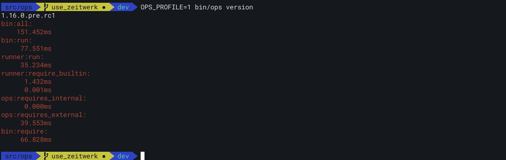

## 1.17.0.rc1

#### One-line actions

Actions like this:

```yaml
test:
  command: bundle exec rspec
```

can now be written like this:

```yaml
test: bundle exec rspec
```

## 1.16.2

#### Output warning instead of stack trace on empty config file

When an environment config or secrets file exists but is empty, `ops` used to print a stack trace and exit (https://github.com/nickthecook/ops/issues/69).

Now `ops` prints a warning and proceeds for empty config and plain JSON secrets files:

```
$ ops exec 'echo hello, world'
Config file 'config/test/config.json' exists but is empty.
Config file 'config/test/secrets.json' exists but is empty.
hello, world
```

Empty `secrets.ejson` files did not cause a stack trace or print a warning before, and the behaviour of `ops` in this case is unchanged.

## 1.16.1

#### Use zeitwerk for performance reasons

Here's the new benchmark output against 1.15.0.pre.rc2:

> Green numbers are at least 10% better than in previous version; red are 10% worse.


Against 1.14.1:


Against 1.13.1:


Although that last one is not really fair, as it's comparing the last version without any performance optimization, it does illustrate the gain in switching from just requiring all required files at the top of every source file to zeitwerk.

> These benchmarks were run on a machine with a security app that scans every file as its opened. Therefore, performance is a bit worse that it would be otherwise, and the difference between most builtins and `ops help`, which opens a dozen or so more `.rb` files than other builtins, is significantly exaggerated.

#### Add profiler

This release also includes the basic profiling code that identified `require`s as the biggest time consumer in `ops`.

Set `OPS_PROFILE` to anything and you will get profiling data on STDERR:



Check the code for specifics, but `bin:` tags are blocks in `bin/ops`. `bin:run` happens inside `bin:all`, and `runner:run` happens inside `bin:run`.

`runner:require_builtin` receives special attention from the profiler since that's where the big hit was in performance. That was over half a second in 1.13.0.

#### Add benchmarks

As seen above, `ops benchmark` was also added in this release. It will use [hyperfine](https://github.com/sharkdp/hyperfine) to benchmark the installed version of `ops` and compare to `bin/ops`.

It's interesting to build and install a gem, then run `ops benchmark`, effectively comparing the same code, but one with gem loading overhead and one without:


This shows a 100ms overhead to running anything via the gem compared to just running `bin/ops`. The `Avg difference` stat is calculated so you can get a feel for what this overhead is on your machine. Keep it in mind when looking at the output of `ops benchmark`, including the above images.

A future version may build and install `ops` and run the current code as a gem to remove this unfair advantage.

## 1.14.1

#### Fix `ops help` output

`ops help` was broken in 1.14.0, and listed only one builtin: 'help' itself. This was due to performance optimizations in 1.14.0 not eager loading all builtin classes.

## 1.14.0

#### Reduce overhead time of ops by 50%

In the following output, `ops` is 1.13.0 and `bin/ops` is 1.14.0:

```shell
$ time ops env
devops env  0.32s user 0.18s system 47% cpu 1.037 total
$ time bin/ops env
devbin/ops env  0.10s user 0.08s system 42% cpu 0.437 total
$ time ops exec 'echo hi there'
hi there
ops exec 'echo hi there'  0.32s user 0.19s system 49% cpu 1.016 total
$ time bin/ops exec 'echo hi there'
hi there
bin/ops exec 'echo hi there'  0.12s user 0.10s system 46% cpu 0.464 total
$ time ops exec ls
Gemfile				docs				ops.yml				ops_team-1.6.1.gem		pebble
Gemfile.lock			etc				ops_team-1.11.0.pre.rc.gem	ops_team-1.6.2.gem		platforms
LICENSE				keys				ops_team-1.13.0.gem		ops_team-1.7.0.gem		runtime_data
README.md			lib				ops_team-1.6.0.gem		ops_team-2.0.0.gem		spec
bin				loader.rb			ops_team-1.6.0.pre.pre.gem	ops_team.gemspec		tmp
config				ops.png				ops_team-1.6.0rc1.gem		ops_up.out
ops exec ls  0.31s user 0.19s system 49% cpu 1.023 total
$ time bin/ops exec ls
Gemfile				docs				ops.yml				ops_team-1.6.1.gem		pebble
Gemfile.lock			etc				ops_team-1.11.0.pre.rc.gem	ops_team-1.6.2.gem		platforms
LICENSE				keys				ops_team-1.13.0.gem		ops_team-1.7.0.gem		runtime_data
README.md			lib				ops_team-1.6.0.gem		ops_team-2.0.0.gem		spec
bin				loader.rb			ops_team-1.6.0.pre.pre.gem	ops_team.gemspec		tmp
config				ops.png				ops_team-1.6.0rc1.gem		ops_up.out
bin/ops exec ls  0.12s user 0.10s system 43% cpu 0.496 total
```
