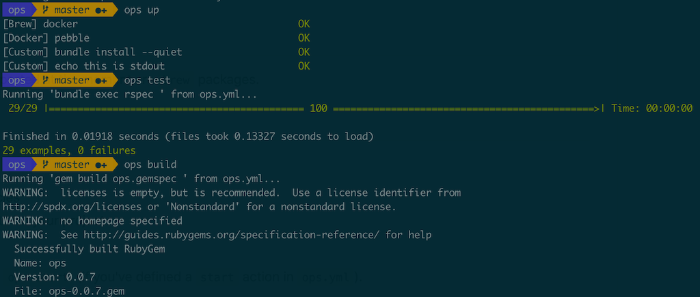

# ops

**This gem is still quite new; if you encounter an issue, please open an Issue in this project.**

[](https://badge.fury.io/rb/ops_team)

[View on RubyGems.org](https://rubygems.org/gems/ops_team)

`ops` is like an operations team for your project. It aims to be:

- **simple**: easy to use even for people who know nothing about how the tool works
- **self-contained**: no references to external resources, just `git clone` and `ops up`
- **environment-aware**: make things easy in `dev` while allowing it to co-exist with `production`



Built-in commands are listed under "Builtins" in the `ops help` output. These `ops` commands will be available in any ops-enabled project.

Actions are defined in `ops.yml` in the current directory. They are project-specific.

## Getting started

### Installing

##### With a normal Ruby installation

Manually:

`gem install ops_team`

You can install the `ops_team` gem with bundler, but more likely `ops` will be installing and running bundler; not the other way around.

`gem 'ops_team'`


##### On a Mac with built-in Ruby

```shell
gem i --user-install ops_team
```

In this case, you may need to add your gems' `bin/` directory to your `$PATH` variable. To find the path to the right `bin/` directory:

```
$ gem environment | grep "EXECUTABLE DIRECTORY"
  - EXECUTABLE DIRECTORY: /Users/nick/.gem/ruby/2.6.6/bin
```

To add it to your path, append this to your `.bashrc` or `.zshrc` (or equivalent for your shell):

```
export PATH="$PATH:/Users/yourusernamehere/.gem/ruby/2.6.6/bin"
```

### Testing

To make sure the gem is installed and the `ops` executable is in your `$PATH`:

```
$ ops version
0.6.0
$
```

### Running

```shell
# from the repo where you wish to use ops
ops init
```

There are some specialized templates for terraform and ruby projects. You can run:

```shell
ops init terraform  # template pre-populated with common terraform configuration
ops init ruby       # template pre-populated with common ruby configuration
```

*(If you'd like to see a template for another language, please submit a PR.)*

Edit `ops.yml` to suit your needs. There will be some examples in there that you will want to change.

Add an action like:

```yaml
actions:
  hello-world:
    command: "echo hello world"
    alias: h
```

Then run `ops h` (to use the alias) or `ops hello-world` to use the full command name.

```
$ ops h
Running 'echo hello world ' from ops.yml in environment 'dev'...
hello world
```

### Sample `ops.yml`

The ruby template for `ops.yml` looks something like:

```yaml
dependencies:
  gem:
    - bundler
    - rerun
  custom:
    - bundle
actions:
  start:
    command: echo update me
    description: starts the app
  stop:
    command: echo update me too
    description: stops the app
  test:
    command: rspec
    alias: t
    description: runs unit tests
  test-watch:
    command: rerun -x ops test
    alias: tw
    description: runs unit tests every time a file changes
  lint:
    command: bundle exec rubocop --safe-auto-correct
    alias: l
    description: runs rubocop with safe autocorrect
  build:
    command: gem build *.gemspec
    alias: b
    description: builds the gem
  install:
    command: gem install `ls -t *.gem | head -n1`
    alias: i
    description: installs the gem
  build-and-install:
    command: ops build && ops install
    alias: bi
    description: builds and installs the gem
```

## Dependencies

In the above sample file, the `dependencies` section lists things that this project depends on in order to run. These dependencies are satisfied when the `ops up` command is run.

The following dependency types are supported:

- `brew`: installs a package using [Homebrew](https://brew.sh/) if running on a Mac
- `apt`: installs a package using `apt` if running on linux
- `apk`: installs a package using `apk` if running on alpine linux
- `gem`: installs a gem
- `docker`: uses `docker-compose` to start and stop a service in a subdirectory of your project
- `custom`: runs a custom shell command
- `dir`: creates a local directory (for when your app needs a directory, but there are no checked-in files in it)

`ops up` is **idempotent**, so if you're not sure what your local state is, or you've just added one dependency, you can run `ops up` and `ops` will only try to satisfy unsatisfied dependencies.

This feature allows developers that are new to a project to get up and running **without knowing anything about the app itself**. Your `ops.yml` should allow a developer to `ops up && ops start` to run an application.

For more details on dependencies, see [Dependencies](docs/dependencies.md).

## Builtins

Built-in commands are:

```
  init                  creates an ops.yml file from a template
  version               prints the version of ops that is running
  down                  stops dependent services listed in ops.yml
  env                   prints the current environment, e.g. 'dev', 'production', 'staging', etc.
  exec                  executes the given command in the `ops` environment, i.e. with environment variables set
  help                  displays available builtins and actions
  up                    attempts to meet dependencies listed in ops.yml
```

## Actions

Actions are defined in the `actions` section of `ops.yml`. If the first argument to `ops` is not a builtin (see section above), `ops` will look for an action with that name.

```yaml
actions:
  test:
    command: bundle exec rspec
    alias: t
  test-watch:
    command: rerun -x ops test
    alias: tw
```

This snippet shows two actions: `test` and `test-watch`. When `ops test` is run, `ops` will run `bundle exec rspec`.

Note that `test-watch` actually uses rerun to run `ops`; since `ops` is just an executable in your `$PATH`, it can be used in a `command` itself. This technique can be used to avoid duplicating parts of some commands, e.g. the `bundle exec rspec` in `test`.

### Aliases

An action can have one alias. If the first argument to `ops` is not a builtin or an action name, `ops` will look for an alias that matches the argument.

In the above example, the `test` action has the alias `t`. When `ops t` is run, `ops` will execute the `test` action.

For more information on actions, see [Actions](docs/actions.md).

## Environments

One of the goals of `ops` is to make things easy in `dev` while allowing it to co-exist with `production`. `ops` uses the concept of "software execution environment" to do this.

By default, `ops` runs actions and builtins in the environment `dev`; that is, if `$environment` is not set, `ops` sets it to `dev`.

Actions and builtins can refer to this variable to do different things in different environments. For example, an app might log to a different directory in `production` than in `dev`:

```yaml
dependencies:
  dir:
    - log/$environment
actions:
  start:
    command: run-the-app &> "log/$environment/app.log"
```

In addition, `ops` will attempt to load other environment variables from the config file `config/$environment/config.json` and secrets from `config/$environment/secrets.ejson`. This allows your repo to support different configurations for different environments without implementing support in your code. For more information about this feature, see [Config and Secrets](docs/config_and_secrets.md).

For more information about `ops` and environment variables, see [Environment Variables](docs/environment.md).

## Contributing

Submit a PR that meets the following super-strict criteria:

- tests have been added or updated for your code changes
- `ops test` passes
- `ops lint` passes
