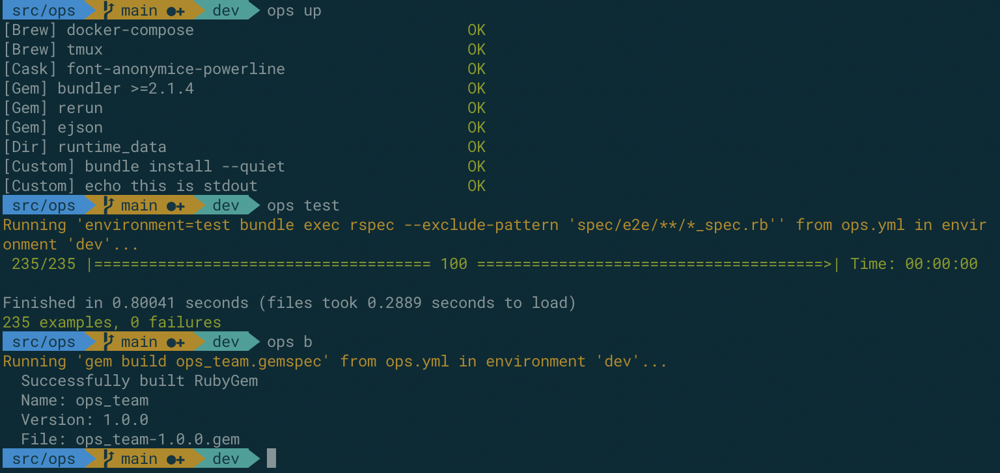

# ops

`ops` is like an operations team for your dev environment. It:

- reduces the cognitive load of getting up and running as a new developer on a project
- saves time by allowing command-line shortcuts for common tasks
- can be used in CI, to install dependencies, start services, and run tests, exactly as you do on your dev machine

The typical workflow is:

```
ops init   # to create the ops.yml file so you can edit
ops up     # to install dependencies and start services your app depends on
ops start  # to start your app
ops test   # to test your app
ops stop   # to stop your app
```



## Getting started

### Installing

#### On Linux, or if you've installed your own Ruby interpreter on a Mac

```shell
# from this repo
gem build ops.gemspec
gem i ops-<version>.gem
```

#### On Mac with built-in Ruby

```shell
# from this repo
gem build ops.gemspec
gem i --user-install ops-<version>.gem on a Mac
```

### Running

```shell
# from the repo where you wish to use ops
ops init
```

Edit `ops.yml` to suit your needs. There will be some examples in there that you will want to change.

Add an action like:

```yaml
actions:
  hello-world:
    command: "echo hello world"
    alias: hello
```

Then run `ops hello` (to use the alias) or `ops hello-world` to use the full command name.

The `ops.yml` for `ops` looks something ike:

```yaml
dependencies:
  brew:
    - docker
  apt:
    - curl
  docker:
    - pebble
  custom:
    - bundle install --quiet
    - "echo this is stdout"
actions:
  test:
    command: "bundle exec rspec"
    alias: t
  test-watch:
    command: "bundle exec rerun -x rspec"
    alias: tw
  tag:
    command: "bin/tag"
  build:
    command: gem build ops.gemspec
    alias: b
  install:
    command: gem i `ls -t *.gem | head -n 1`
    alias: i
```

## Dependencies

A few types of dependency are supported:

### `brew`

- specifies that a particular `brew` package is needed
- will only run if you're on a Mac

### `apt`

- specifies that a particular package from `apt` is needed
- will only run if you're on Linux

### `docker`

E.g.:

```yaml
depdendencies:
  docker:
    deps/mysql
```

- specifies that this repo includes a directory with the given name (e.g. `deps/mysql`) that includes a `docker-compose.yml` file
- `ops` will change to the given directory and use `docker-compose` to start, stop, and check the status of this service as needed

### `terraform`

- specifies that this repo includes a directory with the given name containing a terraform configuration
- `ops` will change to the given directory and use `terraform` to create or destroy resources

**Note:** To avoid prompting the user for input on every `ops up` and `ops down`, `ops` will pass the `--auto-approve` flag to `terraform` on both `apply` and `destroy` operations. You should only use `ops` to manage development resources, and *not* any resources you care about in the least.

### `custom`

E.g.:

```yaml
custom:
  - bundle install --quiet
```

- runs the given command
- can't tell if the command needs to be run or not, so always runs it on `ops up`
- therefore, the command should be idempotent
- it's also a good idea to prevent it from printing output unless it encounters an error, to keep the ops output clean

## Builtins

Built-in commands are:

- `up`: tries to meet the dependencies in the `dependencies` section of `ops.yml`
- `down`: stops services listed in the `dependencies` section of `ops.yml` (but does not uninstall packages)
- `init`: creates `ops.yml` for your project
- any actions you define in the `actions` section of `ops.yml`

E.g. `ops up`, `ops init`, or `ops start` (if you've defined a `start` action in `ops.yml`).

## Actions

Actions are defined in the `actions` section of `ops.yml`. If the first argument to `ops` is not a builtin (see section above), `ops` will look for an action with that name.

```yaml
actions:
  test:
    command: bundle exec rspec
    alias: t
  test-watch:
    command: rerun -x ops test
    alias: tw
```

This snippet shows two actions: `test` and `test-watch`. When `ops test` is run, `ops` will run `bundle exec rspec`.

Note that `test-watch` actually uses rerun to run `ops`; since `ops` is just an executable in your `$PATH`, it can be used in a `command` itself. This technique can be used to avoid duplicating parts of some commands, e.g. the `bundle exec rspec` in `test`.

### Aliases

An action can have one alias. If the first argument to `ops` is not a builtin or an action name, `ops` will look for an alias that matches the argument.

In the above example, the `test` action has the alias `t`. When `ops t` is run, `ops` will execute the `test` action.

### Naming actions

Here are some conventions to follow when naming your actions, so that you end up with common `ops` actions across your projects:

- `ops server` or `ops start` to start your app, if it's a server
- `ops stop` to stop your app
- `ops run` if it's a client, or a program that is expected to exit on its own
- `ops test` to run your local tests
- `ops test-watch` can be handy, using something like the `rerun` gem, to run tests every time a file changes

```yaml
actions:
  server:
    command: docker-compose up # or however you start your service
    alias: s
  stop:
    command: docker-compose down # or however you stop your service
    alias: st
  test:
    command: bundle exec rspec # or whatever runs your unit tests
    alias: t
  test-watch:
    command: rerun -x ops test # runs your tests every time a file changes
    alias: tw
```
